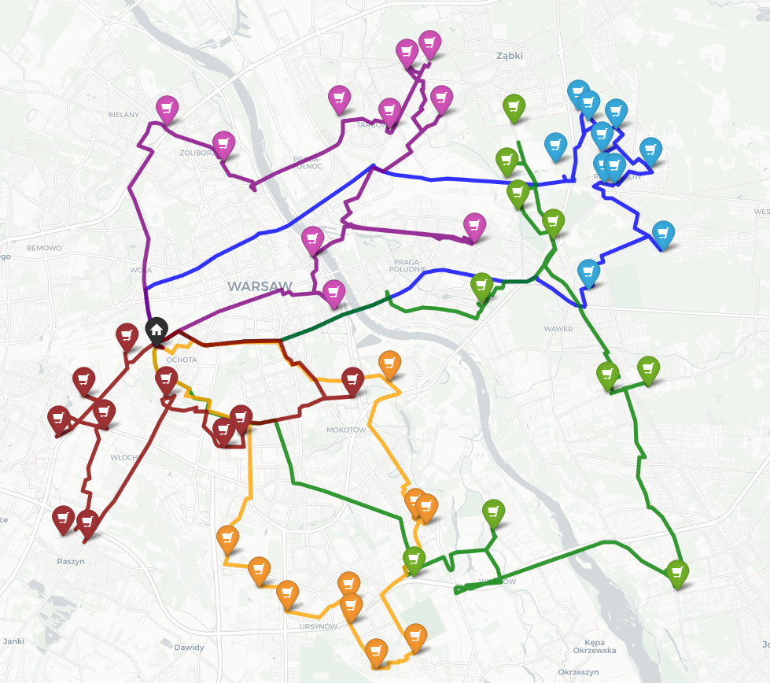
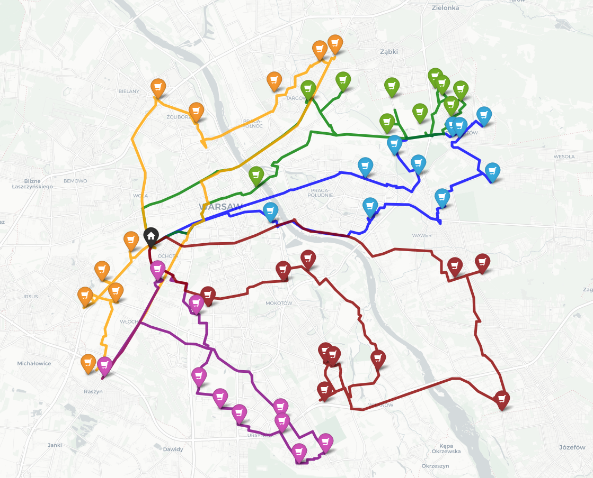
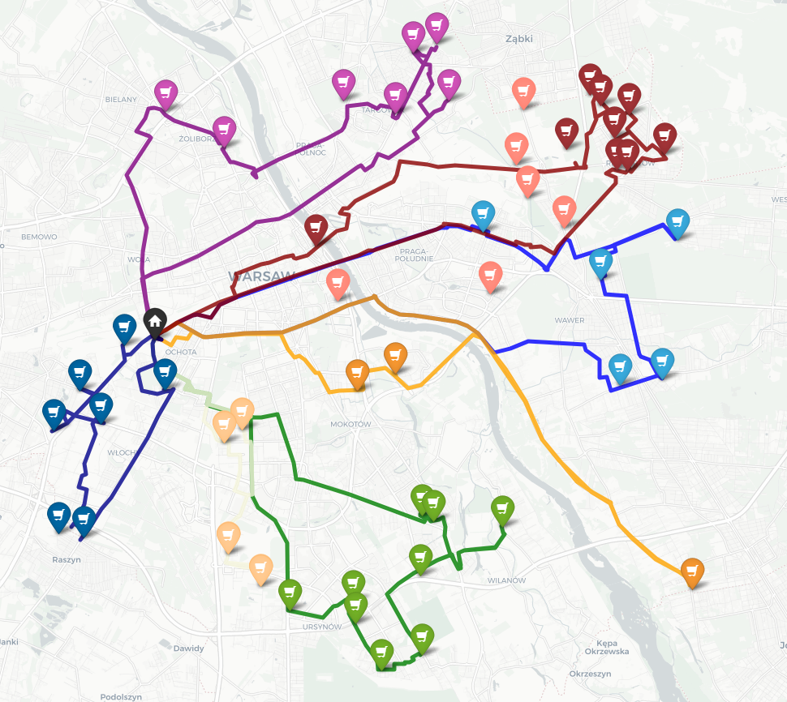
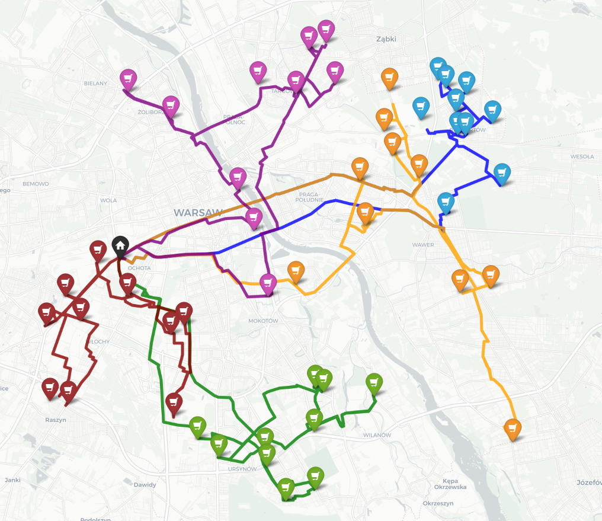

# 🚚 Vehicle Routing Problem (VRP) Logistics Optimizer


An end-to-end routing optimization engine designed for urban delivery networks. The model solves Capacitated Vehicle Routing Problems (CVRP) and Vehicle Routing Problems with Time Windows (VRPTW) over real-world street network topologies using heuristic algorithms.

---

## 📌 Project Overview & Logistics Problem

The objective is to optimize urban last-mile distribution logistics for a retail chain across the metropolitan area of Warsaw, Poland:
* **Network Topology:** 1 central distribution depot (Ochota) serving 50 designated store delivery nodes[cite: 1].
* **Fleet Constraints:** Up to 5–6 delivery vehicles (Renault Master 3.5t FWD, payload 1,473 kg, fuel consumption: 211g CO2/km)[cite: 1].
* **Operational Assumptions:** Each truck handles up to 10 deliveries per route[cite: 1]. Average urban travel speed set to 33.5 km/h with 15-minute service/unloading duration per stop[cite: 1].
* **Time Windows:** Strict 7-hour delivery window (05:00–12:00) modeled and constrained under VRPTW[cite: 1].

---

## 🗺️ Visual Results

### Input: Distribution Network (50 Retail Nodes + Central Depot)


### Routing Strategy Comparison

| Clarke-Wright Savings (Optimized) | Polar Angle Sweep Algorithm |
| :---: | :---: |
|  |  |

| Multi-Fleet Variant (CW - 6 Vehicles) | Heuristic Route Trace |
| :---: | :---: |
|  |  |

---

## ⚙️ Architecture & Technical Methodology

1. **Graph Construction & Geolocation:**
   * Node coordinates parsed via OpenStreetMap and `Overpass API`[cite: 1].
   * Road network extraction and topological driving graph constructed using `OSMnx` (`ox.graph_from_place`)[cite: 1].
   * Real road network shortest distance matrix ($51 \times 51$) computed using Dijkstra's algorithm via `NetworkX`[cite: 1].

2. **Implemented Solvers:**
   * **Sweep Algorithm (Polar Angle Method):** Angular transformation relative to the central depot ($\alpha_p = \text{atan2}(\Delta y, \Delta x)$) followed by radial sector clustering and route sequencing[cite: 1].
   * **Clarke-Wright Savings Algorithm:** Iterative route merging maximizing edge savings ($s_{ij} = c_{0i} + c_{0j} - c_{ij}$) subject to capacity and cycle elimination constraints[cite: 1].
   * **Nearest Neighbor (NN):** Greedy sequential node insertion minimizing step-by-step connection costs[cite: 1].
   * **VRPTW Handling:** Heuristic load re-allocation and penalty constraints enforcing strict operational windows and driver service times[cite: 1].

3. **Geospatial Visualization:**
   * Interactive, multi-layered route maps rendered using `Folium` directly overlaying OpenStreetMap polylines[cite: 1].

---

## 📊 Benchmark Comparison & Empirical Results

The models were evaluated against the human-planned baseline routes (285.00 km, 11:01 h drive time)[cite: 1]. Performance was measured using the standard Optimality Gap metric:

$$Gap_{opt} = \frac{c_{Heur} - c_{Opt}}{max(c_{Opt}, \epsilon)} \times 100\%$$

| Strategy / Scenario | Fleet Size | Total Distance | Total Drive Time | Distance Reduction | Drive Time Reduction |
| :--- | :---: | :---: | :---: | :---: | :---: |
| **Sweep Algorithm (Polar Angle)** | **5** | **248.50 km** | **07:22 h** | **-14.69%** | **-49.55%** |
| Nearest Neighbor (NN) | 5 | 250.25 km | 07:27 h | -13.89% | -47.87% |
| Sweep (VRPTW Constrained) | 6 | 256.85 km | 07:41 h | -10.06% | -43.38% |
| Clarke-Wright (VRPTW Constrained) | 6 | 264.47 km | 07:54 h | -7.76% | -39.45% |
| Clarke-Wright Savings | 5 | 268.01 km | 08:00 h | -6.34% | -37.71% |

### Key Analytical Takeaways
* **Radial Synergy:** The **Sweep Algorithm** outperformed all heuristics due to Warsaw's concentric-radial street topology and the centralized depot position, minimizing cross-river crossings[cite: 1].
* **Greedy Heuristic Limitation:** While **Nearest Neighbor** achieved strong distance cuts, it suffered from sub-optimal return legs due to local-only path evaluation[cite: 1].
* **Time Windows Impact:** Tightening operational windows under VRPTW forced the allocation of a 6th vehicle[cite: 1]. Although this increased overall fleet travel compared to the unconstrained 5-truck model, it still reduced total network runtime by over 43% versus baseline planning[cite: 1].

---

## 🚀 Installation & Usage

```bash
# 1. Clone the repository
git clone [https://github.com/mz-analytics/vrp-logistics-optimizer.git](https://github.com/mz-analytics/vrp-logistics-optimizer.git)
cd vrp-logistics-optimizer

# 2. Set up virtual environment and install dependencies
python -m venv venv
source venv/bin/activate  # On Windows: venv\Scripts\activate
pip install -r requirements.txt

# 3. Execute optimization solvers
python vrp_optimizer.py
