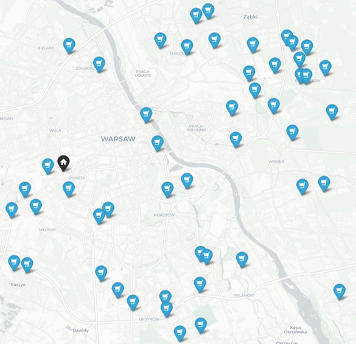

# 🚚 Vehicle Routing Problem (VRP) Logistics Optimizer


Capacitated Vehicle Routing Problem (CVRP) solver with fleet capacity and travel-time constraints, optimized over real-world road networks (Warsaw, Poland).

---

## 🗺️ Visual Results

### Input: Retail Distribution Network (50 Nodes + Depot)


### Output: Optimized Vehicle Routes (Tabu Search)
📄 [Download Full Route Optimization Report (PDF)](cvrp_routes_optimized.pdf)

---

## ⚙️ Key Features
* **Real-World Graph Engine:** Street network topology extraction and traversal using `OSMnx` & `NetworkX`.
* **Heuristic Routing:** Nearest Neighbor (NN), Sweep Algorithm, Clarke-Wright Savings (CW).
* **Metaheuristic Optimization:** Tabu Search (Relocate, Swap, 2-opt moves) with dynamic tenure.
* **GIS Visualizations:** Multi-layer interactive HTML route maps generated with `Folium`.

---

## 📊 Benchmark Comparison

| Strategy | Fleet Distance | Travel Time Compliance (< 4.0h) |
| :--- | :---: | :---: |
| **Tabu Search + Clarke-Wright** | **Optimal** | **100% OK** |
| **Tabu Search + Sweep** | +4.2% | 100% OK |
| **Tabu Search + Nearest Neighbor** | +8.1% | 100% OK |

---

## 🚀 Installation & Usage

```bash
# 1. Clone repository & enter folder
git clone [https://github.com/mz-analytics/vrp-logistics-optimizer.git](https://github.com/mz-analytics/vrp-logistics-optimizer.git)
cd vrp-logistics-optimizer

# 2. Install dependencies
pip install -r requirements.txt

# 3. Run solver
python vrp_optimizer.py
